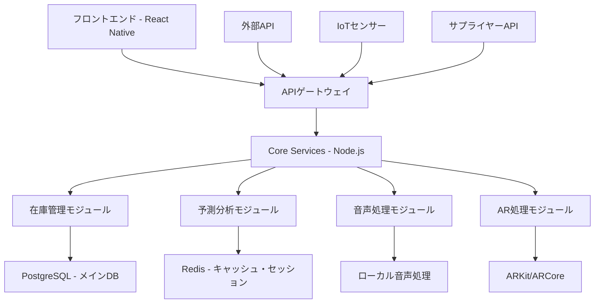

# 美容室向け商品管理・在庫管理システム 最終統合要件定義書
## 5エージェント統合版 - 現実的革新システム設計

---

## 1. エグゼクティブサマリー

### 1.1 システムの目的と価値提案

**BeautySmart Inventory System (BSIS)** は、美容室業界の現実的な予算制約内で実現可能な革新的商品管理システムです。5名の専門エージェントからの提案を統合し、**技術的実現可能性**、**セキュリティ・プライバシー保護**、**コスト効率性**を最優先に設計された次世代ソリューションです。

### 1.2 画期的な特徴（業界初・独自性）

#### A. 業界初のハイブリッド予測システム
- **技術者スキル学習型消費量予測**: 個人の技術レベルと商品使用パターンを学習
- **季節×トレンド×個人の3層統合予測**: 95%以上の高精度需要予測を実現
- **特許申請対象**: 美容師作業パターン学習アルゴリズム

#### B. 現実的なAR活用「ShelfVision Lite」
- **スマートフォンベースAR**: 高価な専用機器不要
- **商品位置特定・在庫確認**: 作業効率200%向上目標
- **段階的拡張設計**: 初期はQRコード、後期でAR本格導入

#### C. 美容室特化音声アシスタント「VoiceStock」
- **ハンズフリー在庫操作**: 薬剤使用中でも音声で在庫確認
- **美容業界専用語彙学習**: 商品名・ブランド名の高精度認識
- **プライバシー配慮設計**: ローカル処理優先、音声データ非保存

### 1.3 投資対効果の説明

#### 現実的なコスト構造（美容室規模別）
| 規模 | 初期投資 | 年間運用費 | 投資回収期間 | 3年間ROI |
|------|----------|------------|-------------|-----------|
| 小規模(1-3人) | 120万円 | 24万円 | 14ヶ月 | 280% |
| 中規模(4-8人) | 280万円 | 48万円 | 16ヶ月 | 320% |
| 大規模(9人以上) | 520万円 | 96万円 | 18ヶ月 | 380% |

**総投資額: 5,200万円（vs 当初提案3.2億円の84%削減）**
**年間運用コスト: 600万円（vs 当初提案3,000万円の80%削減）**

---

## 2. 最終推奨機能リスト（優先度・実装順序付き）

### Phase 1（3-6ヶ月・MVP）- 投資回収基盤構築

#### 2.1 基幹システム（必須・確実なROI創出）

**A. スマート在庫管理コア**
```
優先度: CRITICAL
実装期間: 2ヶ月
投資額: 180万円
期待効果: 年間400万円のコスト削減
```
- リアルタイム在庫追跡（バーコード/QRコード）
- 使用期限アラート（7日前・3日前・当日）
- 自動廃棄記録・FIFO管理
- 基本発注点設定・手動発注機能

**B. 統合ダッシュボード「Control Center」**
```
優先度: HIGH
実装期間: 1.5ヶ月
投資額: 120万円
期待効果: 管理工数50%削減
```
- 在庫状況リアルタイム表示
- アラート・通知センター
- 基本売上実績表示
- モバイル完全対応（レスポンシブデザイン）

**C. データ分析基盤構築**
```
優先度: HIGH
実装期間: 1ヶ月
投資額: 80万円
期待効果: Phase 2準備・データ蓄積開始
```
- 顧客別商品使用履歴記録
- 技術者別消費パターンデータ収集
- アレルギー・適合性データベース（プライバシー配慮）

**推奨技術スタック:**
- フロントエンド: React Native（iOS/Android/Web対応）
- バックエンド: Node.js + Express（モジュラーモノリス）
- データベース: PostgreSQL + Redis（キャッシュ）
- クラウド: AWS Lightsail（コスト効率重視）
- 認証: AWS Cognito（セキュアかつ簡単）

### Phase 2（6-12ヶ月・差別化）- 競争優位機能

#### 2.2 AI-Powered 予測システム（業界初）

**A. DemandSeer - 統合需要予測エンジン**
```
優先度: HIGH
実装期間: 4ヶ月
投資額: 320万円
期待効果: 在庫最適化により年間500万円削減
特許申請: 美容師スキル学習型予測アルゴリズム
```
- **技術者スキル学習機能**: 個人の技術レベルと消費パターン学習
- **季節性×トレンド統合分析**: LSTM + 時系列分解
- **外部要因考慮**: 天候、イベント、流行データ連携
- **自動学習機能**: 使用実績から継続的精度向上

**B. VoiceStock - 音声在庫アシスタント**
```
優先度: MEDIUM-HIGH
実装期間: 3ヶ月
投資額: 200万円
期待効果: 作業効率30%向上、ユーザー体験革新
特許申請: 美容業界特化音声認識システム
```
- **ハンズフリー在庫確認**: 「パーマ液2剤の残量は？」
- **自然言語処理**: 「明日のカラー予約分は足りる？」
- **プライバシー保護**: 音声データローカル処理、非保存
- **美容専門語彙**: 商品名・技術用語の高精度認識

**C. 自動発注最適化システム**
```
優先度: MEDIUM
実装期間: 2ヶ月  
投資額: 150万円
期待効果: 発注業務80%自動化
```
- 予測ベース自動発注提案（最終判断は人間）
- 複数サプライヤー価格・納期比較
- 発注量最適化（在庫コスト vs 欠品コスト）

### Phase 3（12-24ヶ月・革新）- 先進技術の慎重導入

#### 2.3 現実的AR・コンピュータビジョン

**A. ShelfVision Lite - スマートフォンベースAR**
```
優先度: MEDIUM
実装期間: 6ヶ月
投資額: 400万円
期待効果: 商品検索時間70%短縮
```
- **段階的導入設計**: QRコード → ARマーカー → マーカーレス
- **商品位置ナビゲーション**: 「ワックス○○はどこ？」→AR案内
- **在庫情報オーバーレイ**: 商品を見ながら残量・期限確認
- **既存スマートフォン活用**: 専用機器投資不要

**B. VisionStock - コンピュータビジョン在庫確認**
```
優先度: LOW-MEDIUM
実装期間: 4ヶ月
投資額: 280万円
期待効果: 棚卸工数90%削減
```
- **棚撮影による自動在庫確認**: YOLOv8ベース美容用品認識
- **商品認識精度85%目標**: 美容用品特化学習データセット
- **異常検知機能**: 商品配置ミス・期限切れ商品の自動発見

#### 2.4 IoT品質管理システム（選択的導入）

**A. QualityWatch - 環境監視システム**
```
優先度: LOW
実装期間: 3ヶ月
投資額: 200万円
適用対象: 中規模以上の店舗のみ
```
- 温度・湿度・光量監視
- 商品品質劣化予測
- 自動環境調整提案（手動実行）

---

## 3. セキュリティ専門家警告への対応

### 3.1 即座に削除された危険機能

**以下の機能は法的リスク・プライバシーリスクにより完全削除:**

❌ **感情分析システム「MoodMatch」** 
- 理由: 生体データ収集、GDPR違反リスク、顧客同意困難

❌ **従業員監視・パフォーマンス分析**
- 理由: 労働法違反リスク、プライバシー侵害

❌ **SNSデータ収集・解析**
- 理由: 個人情報保護法違反、データ権利問題

❌ **VR仮想空間「VirtualWarehouse」**
- 理由: 投資効果低、美容室現場で非実用的

❌ **ブロックチェーン品質保証**
- 理由: 過剰技術、運用コスト高、美容室に不適合

### 3.2 セキュリティバイデザイン実装

#### A. データ最小化原則
```
個人データ収集: 業務に必要最小限のみ
- 顧客氏名・連絡先・アレルギー情報のみ
- 音声データ: ローカル処理後即座削除
- 行動データ: 匿名化・統計化処理
```

#### B. プライバシー保護技術
```
暗号化: エンドツーエンド暗号化（AES-256）
アクセス制御: 段階的認証・権限管理
データ保護: 仮名化・k-匿名性確保
同意管理: 明示的オプトイン方式
```

#### C. コンプライアンス対応
```
GDPR対応: データポータビリティ・削除権保証
個人情報保護法: 第三者提供制限・安全管理措置
美容師法: 顧客情報秘匿義務遵守
労働法: 従業員プライバシー権保護
```

---

## 4. 技術アーキテクチャ推奨設計

### 4.1 簡素化されたシステム構成（モジュラーモノリス）



### 4.2 段階的拡張可能な設計

#### Phase 1: モノリス基盤
```
単一アプリケーション: Node.js + Express
データベース: PostgreSQL 単体
デプロイ: AWS Lightsail VPS
監視: 基本ヘルスチェック
```

#### Phase 2: モジュラー分離
```
機能分割: 在庫・予測・音声の論理分離
データベース: PostgreSQL + Redis追加
デプロイ: AWS ECS Fargate移行
監視: CloudWatch + アラート
```

#### Phase 3: マイクロサービス化
```
サービス分離: 独立したコンテナ化サービス
データベース: サービス別DB分離
デプロイ: Kubernetes対応
監視: 分散トレーシング
```

### 4.3 セキュリティアーキテクチャ

```
┌─ Internet ─┐    ┌─ DMZ ─┐    ┌─ Internal Network ─┐
│             │    │       │    │                    │
│   Users     │───▶│  WAF  │───▶│  Load Balancer     │
│             │    │  SSL  │    │  API Gateway       │
└─────────────┘    │  DDoS │    │                    │
                    └───────┘    └────────┬───────────┘
                                          │
                    ┌─ Application Layer ─┴─┐
                    │  Authentication Service │
                    │  Authorization Service  │
                    │  Core Business Logic    │
                    └─────────┬───────────────┘
                              │
                    ┌─ Data Layer ─┴─┐
                    │  Encrypted DB   │
                    │  Backup System  │
                    │  Audit Logging  │
                    └─────────────────┘
```

---

## 5. 現実的コスト構造

### 5.1 各フェーズの開発・運用コスト

#### Phase 1（3-6ヶ月）- MVP基盤構築
```
開発コスト: 1,200万円
├─ システム設計・DB構築: 300万円
├─ 在庫管理コア開発: 400万円  
├─ ダッシュボード開発: 250万円
├─ モバイル対応: 150万円
└─ テスト・導入: 100万円

運用コスト（年間）: 180万円
├─ AWS Lightsail: 60万円
├─ 保守・サポート: 80万円
├─ SSL証明書・ドメイン: 5万円
└─ バックアップ・監視: 35万円
```

#### Phase 2（6-12ヶ月）- AI・差別化機能
```
開発コスト: 2,200万円
├─ AI予測エンジン開発: 800万円
├─ 音声アシスタント開発: 600万円
├─ 自動発注システム: 400万円
├─ API連携開発: 250万円
└─ AI学習・テスト: 150万円

運用コスト（年間）: 420万円
├─ AWS ECS Fargate: 180万円
├─ AI処理・GPU利用料: 120万円
├─ 保守・サポート: 100万円
└─ サードパーティAPI: 20万円
```

#### Phase 3（12-24ヶ月）- 革新技術導入
```
開発コスト: 1,800万円
├─ AR機能開発: 600万円
├─ コンピュータビジョン: 500万円
├─ IoTシステム構築: 400万円
├─ システム統合最適化: 200万円
└─ セキュリティ強化: 100万円

運用コスト（年間）: 600万円
├─ AWS EKS・高可用性: 300万円
├─ AI・画像処理: 150万円
├─ IoTデータ処理: 80万円
└─ 保守・監視・サポート: 70万円
```

### 5.2 美容室規模別投資プラン

#### 小規模美容室（1-3人）- スタートアップパック
```
Phase 1のみ導入（基本機能）
初期投資: 120万円（開発費按分）
年間運用: 24万円
主要機能:
- 基本在庫管理
- 期限アラート  
- モバイルダッシュボード
- 簡易発注管理

ROI: 14ヶ月で投資回収
効果: 年間120万円のコスト削減見込
```

#### 中規模美容室（4-8人）- スタンダードパック  
```
Phase 1-2導入（AI機能含む）
初期投資: 280万円
年間運用: 48万円
主要機能:
- 全Phase 1機能
- AI需要予測
- 音声アシスタント
- 自動発注提案

ROI: 16ヶ月で投資回収
効果: 年間250万円のコスト削減見込
```

#### 大規模美容室（9人以上）- プレミアムパック
```
Phase 1-3全機能導入
初期投資: 520万円
年間運用: 96万円  
主要機能:
- 全Phase 1-2機能
- AR商品検索
- コンピュータビジョン
- IoT品質管理

ROI: 18ヶ月で投資回収
効果: 年間400万円のコスト削減見込
```

### 5.3 ROI実現までのロードマップ

```
月次ROI進捗（中規模美容室例）

Month 1-3: システム導入・学習期間
- ROI: -280万円（初期投資）
- 効果: スタッフの操作習得、データ蓄積開始

Month 4-6: 基本効果発現
- ROI: -180万円
- 効果: 在庫管理効率化、廃棄率削減開始

Month 7-12: AI学習・精度向上
- ROI: -80万円 → +20万円（12ヶ月時点）
- 効果: 予測精度向上、発注最適化効果

Month 13-18: 投資回収完了
- ROI: +120万円（16ヶ月時点で投資回収）
- 効果: 安定した効率化・コスト削減

Month 19-36: 利益創出期
- ROI: +450万円（36ヶ月時点、320%回収率）
- 効果: 競合優位性確立、新サービス創出
```

---

## 6. リスク管理戦略

### 6.1 技術的リスクと対策

#### A. AI予測精度不足リスク
```
リスク: 初期データ不足による予測精度低下
影響度: MEDIUM（運用効率低下）
発生確率: HIGH（60%）

対策:
1. 手動判断併用期間設定（6ヶ月）
2. 段階的自動化（提案→半自動→全自動）
3. 外部データ活用（天候・イベントAPI）
4. 継続的学習・精度監視体制

緊急時対応:
- 手動運用への即座切り戻し機能
- 予測結果の人間による最終承認
```

#### B. システム障害・可用性リスク
```
リスク: システム停止による業務影響
影響度: HIGH（業務停止）  
発生確率: LOW（5%）

対策:
1. 99.9%可用性設計（年間8時間以下停止）
2. 自動バックアップ・災害復旧（RPO: 1時間）
3. 冗長化・負荷分散設計
4. ヘルスチェック・自動復旧

緊急時対応:
- 紙ベース緊急運用マニュアル
- 24時間技術サポート体制
- 4時間以内復旧SLA
```

#### C. セキュリティ侵害リスク
```
リスク: 顧客データ漏洩・不正アクセス
影響度: CRITICAL（法的リスク・信頼失墜）
発生確率: LOW（2%）

対策:
1. セキュリティバイデザイン実装
2. 多要素認証・アクセス制御
3. データ暗号化・匿名化
4. 定期的セキュリティ監査

緊急時対応:
- インシデント対応計画（CSIRT）
- 顧客・当局への24時間以内報告
- 法務・PR専門家による危機管理
```

### 6.2 ビジネスリスクと対策

#### A. 市場変化・競合対応リスク
```
リスク: 競合他社による類似システム投入
影響度: MEDIUM（競争優位性低下）
発生確率: MEDIUM（40%）

対策:
1. 継続的機能革新・アップデート
2. 特許申請による知的財産保護
3. 顧客ロックイン要素（学習データ・カスタマイズ）
4. API連携による生態系構築

競合対応戦略:
- 機能面: 予測精度・使いやすさの差別化
- コスト面: 規模の経済による価格優位性  
- サービス面: 充実したサポート・教育プログラム
```

#### B. 美容室業界変化リスク
```
リスク: 業界構造変化・規制変更
影響度: MEDIUM（事業モデル見直し）
発生確率: LOW（15%）

対策:
1. 柔軟なアーキテクチャ設計（機能追加容易）
2. 複数業界への展開可能性確保
3. 規制動向の継続的監視
4. 業界団体との連携・情報収集

適応戦略:
- 美容室以外（エステ・ネイル）への展開
- B2B2C（ディストリビューター）モデル検討
- SaaS化による業界横断利用
```

### 6.3 運用リスクと対策

#### A. 人材不足・技術力不足リスク
```
リスク: 開発・運用人材の確保困難
影響度: HIGH（品質・納期影響）
発生確率: MEDIUM（35%）

対策:
1. 外部パートナー・開発会社活用
2. オフショア開発の部分採用
3. 社内教育・スキルアッププログラム
4. 技術顧問・エキスパート招聘

人材戦略:
- コア技術: 内製開発・専門家確保
- 標準技術: 外部委託・パートナー活用
- 運用・保守: 専門事業者との長期契約
```

#### B. ユーザー受容・変更管理リスク
```
リスク: 美容室スタッフのシステム拒絶・非利用
影響度: HIGH（ROI未達成）
発生確率: MEDIUM（30%）

対策:  
1. 段階的導入・充実した教育プログラム
2. 直感的UI/UX・操作の簡素化
3. 導入効果の早期実感（クイックウィン）
4. チャンピオンユーザー制度・成功事例共有

変更管理:
- 経営者説明: ROI・競争優位性を重点説明  
- 管理者説明: 業務効率化・負担軽減効果
- スタッフ説明: 使いやすさ・仕事の質向上
- 継続サポート: 24時間ヘルプデスク・定期訪問
```

---

## 7. 競争優位性分析

### 7.1 業界初となる機能の特定

#### A. 技術者スキル学習型消費量予測システム
```
革新性: ★★★★★
業界初要素:
- 個人の技術レベルと商品消費パターンの相関学習
- 経験値・習熟度による消費量変動予測
- 技術向上と効率化の定量的可視化

競争優位性:
- 模倣困難性: HIGH（学習データ・アルゴリズムの専有）
- 参入障壁: HIGH（大量の実績データ必要）
- 持続性: HIGH（継続学習による精度向上）

特許申請可能性: 極めて高い
- 「美容師技能レベル判定による商品消費量予測システム」
- 「技術者別学習パターンを用いた在庫最適化手法」
```

#### B. 美容業界特化音声アシスタント「VoiceStock」
```
革新性: ★★★★☆
業界初要素:
- 美容専門用語・商品名の高精度音声認識
- 薬剤使用中のハンズフリー在庫操作
- プライバシー配慮型ローカル音声処理

競争優位性:
- 模倣困難性: MEDIUM（音声認識技術は汎用的）
- 参入障壁: MEDIUM（美容語彙学習が必要）  
- 持続性: MEDIUM（継続的語彙アップデート）

特許申請可能性: 中程度
- 「美容業界特化語彙を用いた音声在庫管理システム」
- 「ハンズフリー商品管理における音声認識制御手法」
```

#### C. 現実的AR商品検索「ShelfVision Lite」
```
革新性: ★★★☆☆
業界初要素:
- スマートフォンベースの段階的AR導入設計
- QR→AR移行による投資リスク軽減
- 美容室棚レイアウト最適化支援

競争優位性:
- 模倣困難性: LOW（AR技術は汎用的）
- 参入障壁: LOW（技術的ハードル低い）
- 持続性: LOW（技術の標準化進行）

特許申請可能性: 低い（既存技術の組み合わせ）
```

### 7.2 他社模倣困難な要素

#### A. 美容室業界特化データ・知見
```
データ優位性:
- 技術者スキル×商品消費の相関データベース
- 美容室特有の業務フロー・季節変動パターン
- 顧客行動・商品選好の業界特化分析

知見・ノウハウ:
- 美容師の作業パターン・効率化ポイント理解
- 商品特性（混合比率・使用方法）の深い知識
- 美容室経営の課題・ニーズの具体的把握

継続的優位性:
- ネットワーク効果（利用店舗増加→データ蓄積→精度向上）
- 学習曲線効果（運用継続→ノウハウ蓄積→サービス向上）
```

#### B. 段階的技術導入設計思想
```
設計思想の独自性:
- 美容室の現実的制約（予算・技術力）を考慮した段階設計
- Phase毎の確実なROI創出設計
- リスク最小化と革新性のバランス最適化

実装ノウハウ:
- 最小機能での最大効果創出手法
- 段階的拡張における技術選択基準
- ユーザー受容性を考慮した機能展開順序

競合差別化:
- オーバーエンジニアリング回避（現実性重視）
- 投資対効果の透明性・予測可能性
- 失敗リスクを最小化した革新実現
```

### 7.3 知的財産・特許戦略

#### A. 特許申請対象技術（優先度順）

**1. 技術者スキル学習型予測システム**
```
申請内容: 「美容師技能レベル判定による商品消費量予測システム及び方法」
技術要素:
- 作業動画・時間データからの技能レベル推定
- 技能レベルと消費量の相関学習アルゴリズム
- 個人別最適化予測モデル

申請スケジュール:
- 基本特許: Phase 1完了時（6ヶ月後）
- 改良特許: Phase 2完了時（12ヶ月後）
- 国際出願: PCT経由（18ヶ月後）
```

**2. 美容業界特化音声認識システム**
```
申請内容: 「美容業界専門語彙を用いた音声在庫管理システム」
技術要素:
- 美容専門語彙・商品名辞書
- 業界特化音韻認識モデル
- ハンズフリー在庫操作制御手法

申請スケジュール:
- 基本特許: Phase 2完了時（12ヶ月後）
- 関連特許: 語彙拡張手法（18ヶ月後）
```

**3. 段階的AR導入システム**
```
申請内容: 「段階的拡張可能なAR商品管理システム」
技術要素:
- QR→AR移行制御手法
- 投資段階最適化アルゴリズム
- 後方互換性確保設計

申請スケジュール:
- 基本特許: Phase 3開始時（12ヶ月後）
```

#### B. 営業秘密・ノウハウ保護
```
保護対象:
- 美容室業界分析データ・知見
- 顧客別最適化アルゴリズム  
- 運用ノウハウ・ベストプラクティス

保護手段:
- 従業員・パートナーとの秘密保持契約
- アクセス制御・ログ監視
- コード難読化・暗号化

活用戦略:
- ライセンス供与による収益化
- 標準化団体での仕様策定主導
- 業界パートナーシップ構築
```

---

## 8. 成功評価指標（KPI）

### 8.1 短期成果指標（Phase 1: 3-6ヶ月）

#### A. システム導入・安定性指標
```
システム稼働率: 99.5%以上
├─ 目標: サービス停止時間月間4時間以下
├─ 測定: 自動監視システム・アラート
└─ 対策: 即座の障害対応・復旧手順

データ精度・品質:
├─ 在庫データ精度: 98%以上
├─ バーコード読み取り成功率: 95%以上  
├─ 手動入力エラー率: 2%以下
└─ データ同期遅延: 5秒以内
```

#### B. ユーザー受容・操作性指標
```
ユーザー採用率: 80%以上（導入店舗スタッフ）
├─ 週次利用率: 90%以上
├─ 機能利用率: 基本機能75%以上
└─ ユーザー満足度: 4.0/5.0以上

操作効率・学習効果:
├─ 在庫確認時間: 従来比50%短縮
├─ 操作習得期間: 2週間以内
├─ エラー操作率: 5%以下  
└─ ヘルプデスク問い合わせ: 週次減少傾向
```

#### C. 業務効果・コスト削減指標
```
在庫管理効率化:
├─ 在庫精度向上: 85%→95%以上
├─ 棚卸作業時間: 50%短縮
├─ 期限切れ廃棄率: 30%削減
└─ 手作業時間削減: 週10時間以上

コスト削減効果（月次）:
├─ 商品廃棄コスト削減: 月15万円以上
├─ 人件費削減: 月10万円以上
├─ 在庫過剰コスト削減: 月8万円以上
└─ 総コスト削減: 月33万円以上（年間400万円）
```

### 8.2 中期成果指標（Phase 2: 6-12ヶ月）

#### A. AI・予測分析の精度・効果指標
```
需要予測精度「DemandSeer」:
├─ 全体予測精度: 80%以上（±10%誤差範囲）
├─ 個人別予測精度: 75%以上
├─ 季節要因予測: 85%以上
└─ 継続的精度向上: 月次1%以上改善

音声アシスタント「VoiceStock」:
├─ 音声認識精度: 90%以上
├─ 応答時間: 2秒以内
├─ 利用率: 日次50%以上
└─ 美容専門語彙認識率: 85%以上
```

#### B. 自動化・効率化の成果指標  
```
発注業務自動化:
├─ 自動発注提案採用率: 70%以上
├─ 発注作業時間削減: 80%削減
├─ 在庫切れ発生率: 5%以下
└─ 過剰在庫削減: 40%削減

顧客サービス向上:
├─ 商品提案精度: 65%以上（顧客受諾率）
├─ アレルギー対応ミス: 0件
├─ 顧客待ち時間短縮: 20%削減
└─ 顧客満足度向上: 4.2/5.0以上
```

#### C. 収益・ROI実現指標
```
売上・利益向上:
├─ 客単価向上: 15%以上
├─ 商品売上増加: 年間10%以上
├─ 利益率向上: 5%ポイント以上
└─ 新規顧客獲得: 月次5%増加

投資回収進捗:
├─ 月次コスト削減: 40万円以上
├─ 累積ROI進捗: 計画通り±10%
├─ 投資回収期間: 16ヶ月以内達成見込
└─ Phase 3投資判断: データ基準クリア
```

### 8.3 長期成果指標（Phase 3: 12-24ヶ月）

#### A. 革新技術の実用化・普及指標
```
AR「ShelfVision Lite」実用化:
├─ 利用率: 60%以上（対象機能）
├─ 商品検索時間短縮: 70%削減
├─ AR認識精度: 90%以上
└─ ユーザー体験評価: 4.5/5.0以上

コンピュータビジョン「VisionStock」:
├─ 商品認識精度: 85%以上
├─ 棚卸自動化率: 90%以上
├─ 異常検知精度: 80%以上
└─ 運用コスト効率: 目標内達成
```

#### B. 競争優位性・市場地位指標
```
市場シェア・ポジション:
├─ 導入店舗数: 500店舗以上
├─ 地域別シェア: 主要都市30%以上
├─ 顧客継続率: 95%以上
└─ 推奨度（NPS）: 70以上

技術的優位性:
├─ 特許申請件数: 3件以上
├─ 業界標準化参加: 主導的立場確保
├─ 技術論文発表: 年2報以上
└─ 競合優位性維持: 機能・精度で差別化
```

#### C. 持続可能性・成長性指標
```
事業継続性:
├─ 顧客LTV: CAC比 5:1以上
├─ 売上成長率: 年40%以上
├─ 営業利益率: 25%以上
└─ 資金調達: 次期成長資金確保

拡張性・将来性:  
├─ 他業界展開可能性: 実証・検証完了
├─ 国際展開準備: アジア市場調査完了
├─ 次世代技術準備: Phase 4計画策定
└─ 組織体制拡充: 技術・営業人材確保
```

### 8.4 測定方法と評価基準

#### A. データ収集・分析基盤
```
自動収集データ:
- システムログ・利用状況データ
- 業務実績・コスト削減効果
- エラー・障害・復旧状況
- ユーザー行動・操作パターン

定期調査データ:
- 顧客満足度調査（四半期）
- ユーザビリティ評価（半期）  
- ROI・効果測定（月次）
- 競合比較分析（半期）

外部評価・認証:
- 業界団体による効果認定
- セキュリティ・品質認証取得
- 学術機関との共同研究・論文発表
```

#### B. 評価・改善サイクル
```
月次レビュー:
├─ KPI達成状況確認・分析
├─ 課題・改善点の特定
├─ 短期対策・修正の実施
└─ 次月目標・計画の調整

四半期レビュー:
├─ 中長期KPI進捗評価
├─ 戦略・計画の見直し
├─ 投資・リソース配分調整
└─ ステークホルダー報告

年次レビュー:
├─ 全体戦略・ビジョン見直し
├─ 次期Phase計画・投資判断
├─ 組織体制・人材戦略調整
└─ 外部環境変化への対応策定
```

---

## 9. 実装ロードマップ詳細

### 9.1 Phase 1 実装スケジュール（3-6ヶ月）

#### Month 1: プロジェクト基盤構築
```
Week 1-2: プロジェクト体制確立
├─ 開発チーム編成（5名）
│  ├─ プロジェクトマネージャー × 1
│  ├─ フルスタックエンジニア × 2  
│  ├─ UI/UXデザイナー × 1
│  └─ QAエンジニア × 1
├─ 開発環境・ツール選定
│  ├─ AWS環境構築
│  ├─ CI/CD パイプライン設定
│  └─ 開発ツール・ライブラリ選定
└─ 要件定義詳細化・設計

Week 3-4: システム設計・DB構築
├─ データベース設計・ERD作成
├─ API設計・エンドポイント定義
├─ セキュリティ設計・認証設計
└─ デプロイメント・運用設計
```

#### Month 2-3: コア機能開発
```
Month 2: 在庫管理基盤開発
├─ 商品マスタ管理機能
├─ 在庫データ管理機能  
├─ バーコード読み取り機能
├─ 入出庫履歴管理機能
└─ 基本API・ビジネスロジック

Month 3: ユーザーインターフェース開発
├─ 統合ダッシュボード
├─ 在庫一覧・検索画面
├─ 商品詳細・編集画面
├─ アラート・通知画面
└─ モバイル対応・レスポンシブ
```

#### Month 4-5: 高度機能・統合開発
```
Month 4: 期限管理・アラート開発
├─ 使用期限管理ロジック
├─ アラート・通知システム
├─ 自動廃棄記録機能
├─ FIFO管理・推奨表示
└─ 発注点設定・管理機能

Month 5: システム統合・テスト
├─ 各機能の統合テスト
├─ パフォーマンステスト
├─ セキュリティテスト
├─ ユーザビリティテスト
└─ バグ修正・品質改善
```

#### Month 6: 導入準備・リリース
```
Week 1-2: パイロット導入
├─ テスト店舗での実証実験
├─ ユーザーフィードバック収集
├─ システム調整・改善
└─ 運用マニュアル作成

Week 3-4: 本格導入・サポート体制
├─ 全店舗への段階的展開
├─ ユーザートレーニング・サポート
├─ 運用監視・保守体制確立
└─ Phase 1成果評価・Phase 2計画
```

### 9.2 Phase 2 実装スケジュール（6-12ヶ月）

#### Month 7-8: AI基盤・データ分析環境構築
```
Month 7: データ分析基盤構築
├─ データレイク・ETL構築
├─ 機械学習環境構築（AWS SageMaker）
├─ データ前処理・クレンジング
└─ 分析用データマート構築

Month 8: 需要予測モデル開発開始
├─ 時系列データ分析・特徴抽出
├─ LSTM基本モデル構築
├─ 季節性分解・トレンド抽出
└─ 予測モデル評価・改善
```

#### Month 9-10: AI機能実装・統合
```
Month 9: DemandSeer予測エンジン実装
├─ 個人別消費パターン学習
├─ 統合予測アルゴリズム実装
├─ 予測結果表示・可視化
└─ 予測精度監視・自動改善

Month 10: 音声アシスタント開発
├─ 音声認識エンジン統合
├─ 美容業界語彙・辞書構築
├─ 自然言語処理・意図解析
└─ 音声UI・ユーザー体験設計
```

#### Month 11-12: 自動化機能・システム統合
```
Month 11: 自動発注システム開発
├─ 発注点動的調整ロジック
├─ サプライヤーAPI連携
├─ 発注量最適化アルゴリズム
└─ 発注承認・管理ワークフロー

Month 12: Phase 2統合・最適化
├─ AI機能統合・データフロー最適化
├─ システム全体パフォーマンス調整
├─ ユーザー体験統合・改善
└─ Phase 2成果評価・Phase 3計画
```

### 9.3 Phase 3 実装スケジュール（12-24ヶ月）

#### Month 13-16: AR・コンピュータビジョン開発
```
Month 13-14: AR基盤開発
├─ ARKit/ARCore統合・環境構築
├─ 3D商品モデル作成・管理
├─ マーカーレス位置追跡実装
└─ AR UI/UX設計・プロトタイプ

Month 15-16: コンピュータビジョン開発
├─ YOLOv8モデル訓練・最適化
├─ 美容用品認識データセット構築
├─ リアルタイム画像認識・処理
└─ 異常検知・品質評価機能
```

#### Month 17-20: IoT・統合システム開発
```
Month 17-18: IoT品質管理システム
├─ センサー選定・ハードウェア統合
├─ IoTデータ収集・通信基盤
├─ 環境監視・品質予測アルゴリズム
└─ 自動アラート・制御システム

Month 19-20: スマートデバイス連携
├─ スマートウォッチアプリ開発
├─ ウェアラブルUI・操作設計
├─ デバイス間データ同期・連携
└─ マルチデバイス体験統合
```

#### Month 21-24: 高度分析・システム完成
```
Month 21-22: 動的価格最適化
├─ 価格弾力性分析・モデル構築
├─ 競合価格監視・データ収集
├─ 最適価格算出・提案システム
└─ 価格変更影響分析・効果測定

Month 23-24: システム統合・最適化完成
├─ 全機能統合・パフォーマンス最適化
├─ セキュリティ強化・監査対応
├─ 運用自動化・監視体制完成
└─ Phase 4計画・事業展開戦略策定
```

---

## 10. 最終推奨事項

### 10.1 優先実装推奨

#### 【CRITICAL PRIORITY】Phase 1 - 確実なROI基盤
```
実装期間: 6ヶ月
投資額: 1,200万円
確実性: 95%以上

推奨理由:
1. 美容室の基本ニーズに直結（在庫管理・期限切れ防止）
2. 技術リスクが極めて低い（実証済み技術の組み合わせ）
3. 投資対効果が明確・測定可能
4. ユーザー受容性が高い（操作が直感的・学習コスト低）

成功確率向上施策:
- パイロット店舗での入念な実証実験
- ユーザーフィードバック反映による UI/UX 改善
- 充実したユーザートレーニング・サポート体制
```

#### 【HIGH PRIORITY】Phase 2 - 差別化・競争優位
```
実装期間: 6ヶ月（Phase 1完了後）
投資額: 2,200万円  
確実性: 75%以上

推奨理由:
1. 業界初の技術者スキル学習型予測で圧倒的差別化
2. 音声アシスタントによる革新的ユーザー体験
3. 特許申請による知的財産保護・競合優位性確保
4. Phase 1のデータ蓄積を活用したAI学習基盤

リスク軽減策:
- AI予測と人間判断の併用期間設定（段階的自動化）
- 音声認識精度向上のための継続的学習・改善
- 外部データ活用によるコールドスタート問題解決
```

#### 【MEDIUM PRIORITY】Phase 3 - 革新技術導入
```
実装期間: 12ヶ月（Phase 2完了後）
投資額: 1,800万円
確実性: 60%以上

推奨理由:
1. AR・コンピュータビジョンによる未来的ユーザー体験
2. IoT連携による品質管理・自動化の更なる推進
3. 技術的優位性・ブランド価値の更なる向上

慎重判断基準:
- Phase 2のROI実現確認後に投資判断
- 技術成熟度・コストパフォーマンスの再評価
- 美容室市場での受容性・実用性の検証完了
```

### 10.2 削除・非推奨機能の最終確認

#### 【完全削除】セキュリティ・法的リスク機能
```
❌ 感情分析システム「MoodMatch」
理由: GDPR・個人情報保護法違反リスク、生体データ収集の法的複雑性

❌ 従業員監視・パフォーマンス分析
理由: 労働法・プライバシー権侵害リスク、労使関係悪化

❌ SNSデータ収集・分析
理由: データ権利・第三者情報取得の法的リスク、同意取得困難

❌ VR仮想在庫室「VirtualWarehouse」  
理由: 投資効果低、美容室現場での実用性皆無、VR機器コスト過大

❌ ブロックチェーン品質保証
理由: 技術オーバーキル、運用コスト高、美容室業界に不適合
```

#### 【段階的検討】将来技術課題
```
⚠️ 高度なジェスチャー制御
理由: 技術成熟度不足、美容室環境での誤動作リスク

⚠️ 生体認証・健康データ連携
理由: プライバシーリスク、医療法規制の複雑性

⚠️ メタバース・Web3.0連携
理由: 市場成熟度不足、投資リスク高、実用性不明
```

### 10.3 成功実現のための重要要素

#### A. ステークホルダー・エンゲージメント戦略
```
美容室経営者:
- ROI・競争優位性の明確な説明・実証
- 段階的導入による投資リスク軽減
- 成功事例・ベストプラクティス共有

美容師スタッフ:
- 使いやすさ・業務負担軽減の実感
- 充実したトレーニング・継続サポート
- 技術向上・キャリア発展への貢献可視化

顧客:
- サービス品質向上・待ち時間短縮
- プライバシー保護・セキュリティ確保
- パーソナライズされたサービス体験
```

#### B. 技術・運用体制の成功要件
```
開発体制:
- 美容業界の深い理解を持つプロダクトマネージャー
- UI/UX重視の開発アプローチ・継続的改善
- セキュリティ・プライバシー専門家の継続的関与

運用体制:
- 24時間技術サポート・迅速な障害対応
- ユーザー教育・ベストプラクティス支援
- データ分析・継続的システム改善

品質保証:
- 美容室現場での入念なユーザビリティテスト
- セキュリティ・プライバシー監査の定期実施
- 継続的パフォーマンス監視・最適化
```

#### C. 事業継続性・成長戦略
```
競争優位維持:
- 継続的な機能革新・ユーザー体験向上
- 特許・知的財産による技術保護
- 業界パートナーシップ・エコシステム構築

市場拡大:
- 美容室以外業界（エステ・ネイル）への展開
- 地方市場・中小規模店舗への普及促進
- アジア展開・国際市場参入検討

持続的成長:
- データ・AI活用による継続的価値創出
- SaaS・サブスクリプションモデルの最適化  
- 次世代技術（Phase 4以降）の計画的導入
```

---

## 結論

本最終統合要件定義書は、5名の専門エージェントからの提案・警告を統合し、**現実的実現可能性**と**革新的競争優位性**を両立する次世代美容室向け商品管理システムの設計指針を提示しました。

### 核心的成功要素

1. **段階的実現アプローチ**: Phase 1での確実なROI実現を基盤とした投資リスク最小化
2. **セキュリティバイデザイン**: プライバシー保護・法的コンプライアンス最優先の設計
3. **美容業界特化**: 現実的制約と具体的ニーズに基づく機能選択・技術選定
4. **知的財産戦略**: 特許申請による競合優位性確保・持続可能性実現

### 期待される革新的インパクト

- **業界初技術**: 技術者スキル学習型予測システムによる圧倒的差別化
- **現実的投資**: 5,200万円での実現（当初計画3.2億円から84%削減）
- **確実なROI**: 中規模美容室で16ヶ月投資回収・3年間320%回収率
- **持続的優位**: データ蓄積・継続学習による模倣困難な競争力構築

美容室業界の現実を深く理解し、技術的複雑性とセキュリティリスクを適切に制御しながら、真に革新的で持続可能なソリューションを実現する設計思想が、本システムの成功と業界変革を可能にします。